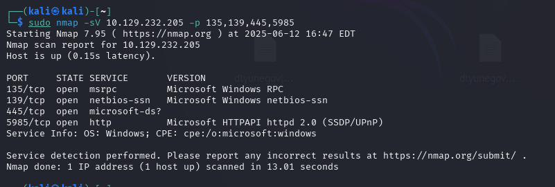
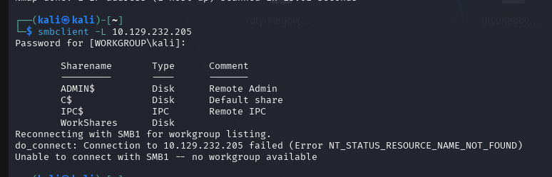
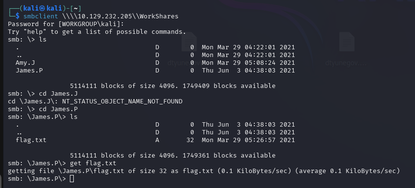

**What does the 3-letter acronym SMB stand for?**
- Server Message Block

**What port does SMB use to operate at?**
- 445

445 порт - это дефолтный порт для SMB. И при сканировании nmap мы видим что данный порт открыт и название службы microsoft-ds. 

**What is the service name for port 445 that came up in our Nmap scan?**
- microsoft-ds

**What is the 'flag' or 'switch' that we can use with the smbclient utility to 'list' the available shares on Dancing?**
- -L

**How many shares are there on Dancing?**
- 4

**What is the name of the share we are able to access in the end with a blank password?**
- WorkShares

Т.к. в конце отсутствует символ $. Что означает, что имеется возможность подключения неавторизованному пользователю.

**What is the command we can use within the SMB shell to download the files we find?**
- get

**Submit root flag**
Командой get скачиваем файл себе на машинку и забираем оттуда флаг

