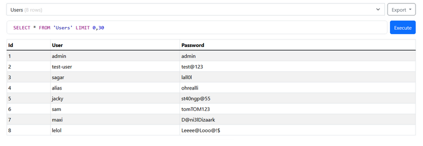

## Введение

В рамках тестирования на проникновение были проведены исследования веб-сервиса методом черного ящика (tornado_app).
Во время тестирования веб-сервиса были использованы следующие инструменты:
Google Dorking, Shodan, Whatweb, Nmap, ZAPPROXY.
## OSINT
#### Google Dorking

**Результат:**
- Скрытые страницы: Не найдены.
- Конфиденциальные файлы: Не обнаружены.

#### Shodan
Результат: данные не найдены

#### Whatweb
http://tornado_app:7788 [200 OK] 
Country[RUSSIAN FEDERATION][RU], 
HTML5, HTTPServer[TornadoServer/5.1.1], 
IP[tornado_app], 
JQuery,
Lightbox,
Meta-Author[www.zerotheme.com],
Script[text/javascript],
Title[Beemer]

Github
https://github.com/ajinabraham/Vulnerable_Tornado_App

## Сканирование:
#### Nmap
Сканирование было проведено с использованием nmap для выявления статуса портов.

22 - открыт - ssh - OpenSSH 8.2p1 
7788 - открыт - http - Tornado httpd 5.1.1
10050 - открыт - zabbix-agent 

а также найдено название хоста 1427771-cg36175.tw1.ru


#### Nikto
- Отсутствует заголовок X-Frame-Options
+ Отсутствует заголовок X-Content-Type-Options
+ Найдена страница /login.html: Admin login page/section found.
+ 

#### Поиск директорий (FFUF)
Найдено:
	- index_html
	- read
	- search
	- upload


## Автоматизированное тестирование
#### ZAPPROXY
##### Найденные запросы:
- GET /robots.txt
- GET /sitemap.xml
- GET /index.html
- GET /server.html
- GET /login.html
- GET /read?file=
- POST /server.html
- POST /login.html
- POST /upload

##### Найденные уязвимости:


- Отраженная XSS уязвимость: http://tornado_app:7788/search?q=%3CscrIpt%3Ealert%281%29%3B%3C%2FscRipt%3E


- Доступ к файлам и директориям: http://tornado_app:7788/read?file=../../../../../../../../../../../../../../../../etc/passwd


- Удаленное выполнение команд 
```
curl --location 'http://tornado_app:7788/server.html' \
--header 'Content-Type: application/x-www-form-urlencoded' \
--data-urlencode 'server=127.0.0.1&ls'
```


- Возможность выполнения SQL-инъекций
```
curl --location 'http://tornado_app:7788/login.html' \
--header 'Content-Type: application/x-www-form-urlencoded' \
--data-urlencode 'username='\'' OR '\''1'\'' == '\''1'\'' -- -' \
--data-urlencode 'password=test'
```


- Отсутствует заголовок X-Frame-Options
+ Отсутствует заголовок X-Content-Type-Options
+ Отсутствует заголовок Content Security Policy (CSP)
+ Уязвимости в библиотеке JQuery: 
	+ CVE-2020-11023
	+ CVE-2020-11022


## Ручное тестирование
ssh - отсутствует защита от брутфорса, используется устаревшая версия ssh - OpenSSH 8.2p1
http - /login - отсутствует защита от перебора пароля, используется слабая парольная политика.

## Исследование исходного кода

[https://github.com/ajinabraham/Vulnerable_Tornado_App/](https://github.com/ajinabraham/Vulnerable_Tornado_App/tree/master)

В исходниках найдена база данных с авторизационными данными. Рекомендуется не хранить авторизационные данные в открытом доступе. Пароль при хранении в базе данных должен шифроваться криптографическими средствами. 



В файле [server.py](http://server.py) обнаружены авторизационные данные. Данные не должны храниться непосредственно в коде.


## Заключение
В результате проведенного исследования были выявлены следующие уязвимости:

| № п/п | Наименование  уязвимости                                                 | Оценка уровня риска | Расположение                                                                | Рекомендации по устранению                                     |
| ----- | ------------------------------------------------------------------------ | ------------------- | :-------------------------------------------------------------------------- | -------------------------------------------------------------- |
| 1     | SQL-инъекция                                                             | Высокий             | http://tornado_app:7788/login.html                                          | Использовать экранирование символов                            |
| 2     | Command injection                                                        | Высокий             | http://tornado_app:7788/server.html                                         | Использовать список белых команд                               |
| 3     | Нарушение механизмов контроля доступа (Path Traversal)                   | Высокий             | http://tornado_app:7788/read?file=                                          | Ограничить доступ к файлам, кроме определенных                 |
| 4     | XSS уязвимость                                                           | Высокий             | http://tornado_app:7788/search?q=                                           | Использовать экранирование символов                            |
| 5     | Файл базы данных с авторизационными данными находится в открытом доступе | Высокий             | https://github.com/ajinabraham/Vulnerable_Tornado_App                       | Рекомендуется удалить файл с БД из гита                        |
| 6     | Слабая парольная политика                                                | Высокий             | http://tornado_app:7788/login.html                                          | усилить требования к паролю                                    |
| 7     | Пароли в БД хранятся в открытом виде                                     | Высокий             | https://github.com/ajinabraham/Vulnerable_Tornado_App/blob/master/test.db   | шифровать логин/пароли с помощью криптографического шифрования |
| 8     | Авторизационные данные прописаны непосредственно в коде программы        | Высокий             | https://github.com/ajinabraham/Vulnerable_Tornado_App/blob/master/server.py | очистить данные из гита                                        |
| 9     | Отсутствует защита от перебора пароля                                    | Средний             | http://tornado_app:7788/login.html                                          | Добавить защиту от перебора пароля                             |
| 10    | Использование устаревших версий ОС и сервисов                            | Средний             |                                                                             | обновить используемое ПО                                       |
| 11    | Отсутствие защитных заголовков HTTP                                      | Низкий              | http://tornado_app:7788                                                     | использовать защитные заголовки HTTP                           |
| 12    | Открыты порты 22, 10050                                                  | Низкий              |                                                                             | не выводить порты за пределы периметра                         |
| 13    | Исходники кода находятся в открытом доступе                              | Низкий              | https://github.com/ajinabraham/Vulnerable_Tornado_App                       | сделать проект закрытым от публичного доступа                  |
